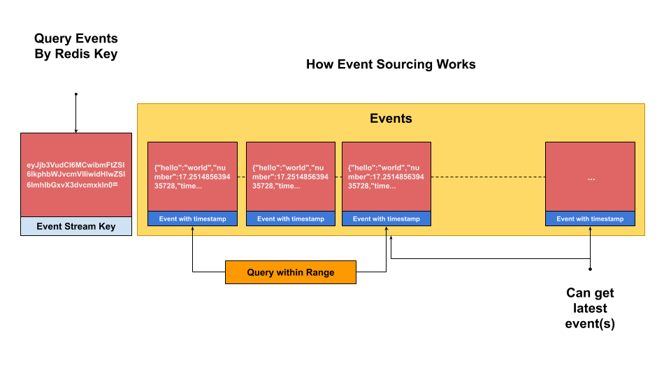
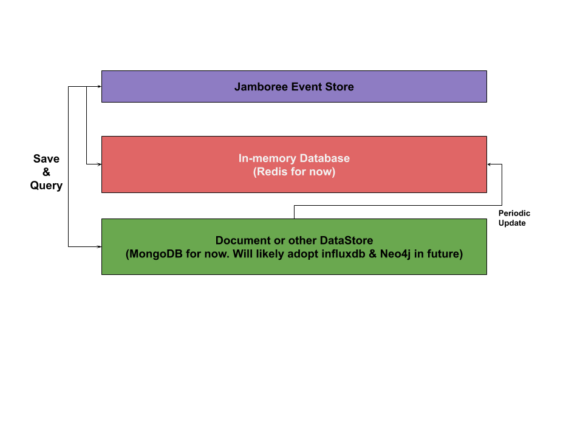

# Key Generation
Here we test how we're going to generate a key for redis so we can query for information later.


```python
%pwd
```


    '/home/skywalker/PycharmProjects/jamboree/test/notebooks'


```python
%cd ../..
```

    /home/skywalker/PycharmProjects/jamboree


```python
import orjson
import maya
import random
```


```python
from jamboree.utils.helper import Helpers
```


```python
helpers = Helpers()
```


```python
sample_key = helpers.generate_hash({"type":"hello_world", "name": "Jamboree", "count": 0})
```


```python
print(f"The sample key is: '{sample_key}'")
```

    The sample key is: 'eyJjb3VudCI6MCwibmFtZSI6IkphbWJvcmVlIiwidHlwZSI6ImhlbGxvX3dvcmxkIn0='


## How we use the generated key to create an eventsource

We'd then store that key into redis and start appending other serialized variables into a list. It looks like the following diagram.


```python
orjson.dumps({"hello": "world", "number": random.uniform(0, 100), "timestamp": maya.now()._epoch})
```


    b'{"hello":"world","number":20.127252760805113,"timestamp":1579529262.278698}'


# Event Diagram

Here's a diagram of an event source.



We continuously push information information into a key, at the tail end of the list. A more recent version of the event sourcing system uses `zlists` to query timing. This actually allows us to have better time indexing.

# Double layer storage system

The Jamboree system uses a double layer storage system. The general idea behind it is that the top layer stores information largely in memory, then the bottom layer stores information in long-term memory. We'll periodically pull records from the hard storage database and repopulate the in-memory database.




```python

```
